# Smurftown

[English](README.md) · [Deutsch](README.de.md) · [Français](README.fr.md) · **Español**

Gestiona todas tus cuentas de Battle.net desde un mismo lugar — y deja que la aplicación inicie
Heroes of the Storm para una cuenta, se conecte y lea el rango, los héroes y las monedas
directamente del juego en marcha.

Solo para Windows. Sin cuenta, sin telemetría, sin ningún dato sobre ti fuera de tu propia
máquina: todo se guarda en `C:\Users\YOUR_USER\.smurftown`. La aplicación hace **exactamente
una** petición, una vez a la hora: le pregunta a GitHub si existe una versión más reciente. [Qué es
eso, y qué no es](#updates).

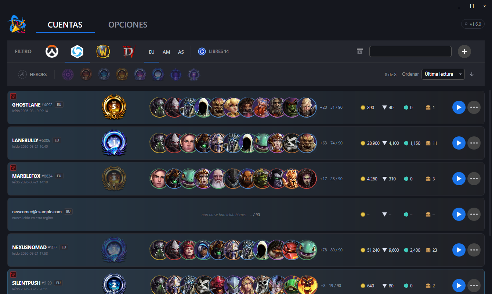

Una fila por cuenta y región. **El rango, los héroes, el oro, las esquirlas, las gemas y los
cofres de esa fila no se escribieron a mano — la aplicación los leyó directamente del juego en
marcha.** Todo lo que sigue explica cómo.

> Todas las capturas de esta página se hicieron con cuentas de demostración inventadas. Ningún
> battletag ni ninguna dirección de aquí pertenece a nadie.

# Características principales

## Cuentas
* Añade y edita cuentas de Battle.net — una fila por cuenta, ordenable y filtrable
* Guarda las credenciales de acceso y copia el correo o la contraseña con un solo clic
* Archiva las cuentas que ya no usas en lugar de eliminarlas — **no hay botón de eliminar**, y es
  a propósito: un clic equivocado en una lista de filas parecidas no debería ser el último paso
* Filtra por nombre, por juego o por héroe
* **Filtra por rango y ordena la lista.** Para Heroes of the Storm, ocho chips de rango — Sin
  rango hasta Gran maestro — reducen la lista a uno o varios rangos a la vez; *Sin rango* cubre
  tanto una cuenta nunca leída como una leída sin rango asignado. Al lado, un control de orden
  (última lectura, nombre, rango, oro, héroes leídos, con un clic para invertir la dirección) y un
  contador de cuentas que coinciden están disponibles para cada juego, no solo Heroes of the Storm.

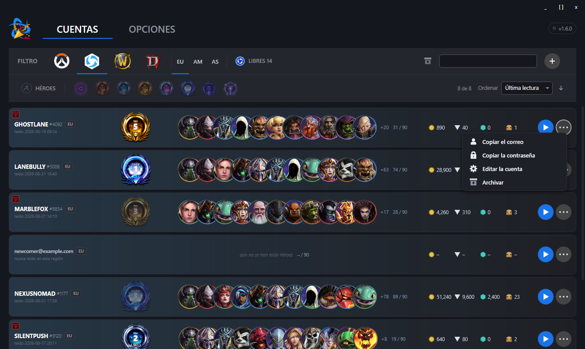

Una cuenta archivada no desaparece, solo se aparta. El interruptor de la barra de herramientas
muestra esa otra mitad de la lista, y el mismo botón de la fila la devuelve a su sitio.

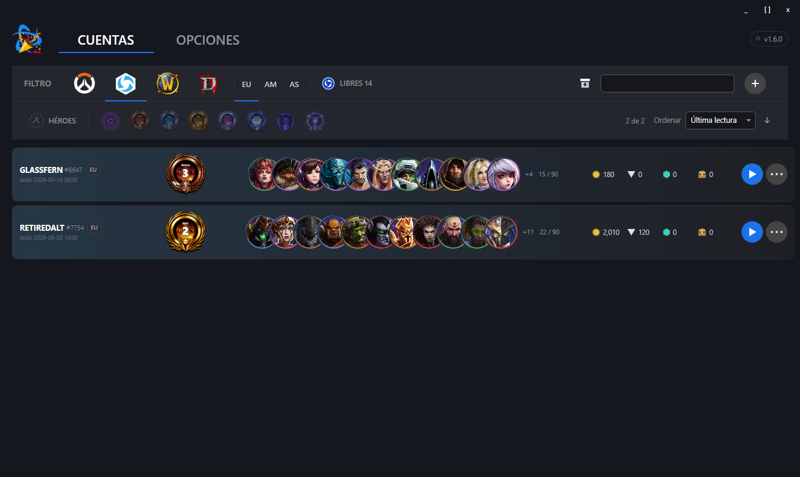
* Marca qué juegos juega cada cuenta: Heroes of the Storm, Overwatch, World of Warcraft, Diablo
* **Elige las regiones en las que juega una cuenta.** El progreso en Heroes of the Storm depende
  de la región, así que una cuenta que juega en Europa y en América tiene dos rangos, dos
  colecciones de héroes y dos cantidades de oro distintas. Cada región que marques obtiene su
  propia fila, y el filtro de región cambia entre ellas.

**El filtro de juego es una vista, no solo un filtro.** Elige Overwatch y cada fila muestra lo que
se sabe sobre Overwatch — que hoy por hoy es nada, y lo dice claramente en lugar de aparentar lo
contrario.

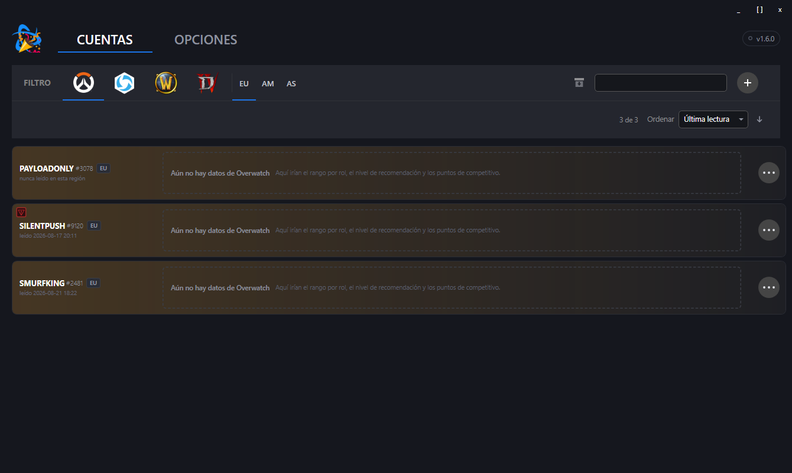

**El filtro de región cambia entre las filas de una misma cuenta.** Abajo están los mismos
battletags de más arriba, pero su lado en América: rango distinto, héroes distintos, oro
distinto. `HALFMOONBAY` tiene marcada América y nunca se ha leído ahí, así que muestra guiones en
lugar de ceros — un cero afirmaría que la cuenta no posee nada, y eso no es algo que sepamos.

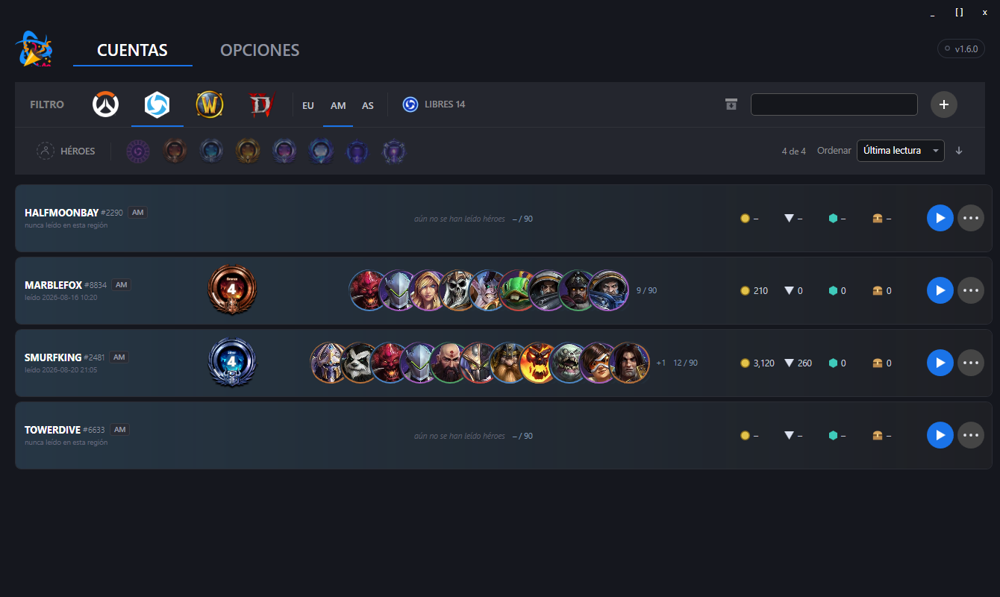

**Todo lo relativo a una cuenta está en un único diálogo.** El battletag se lee del juego, no se
escribe: aparece la primera vez que la cuenta se lee.

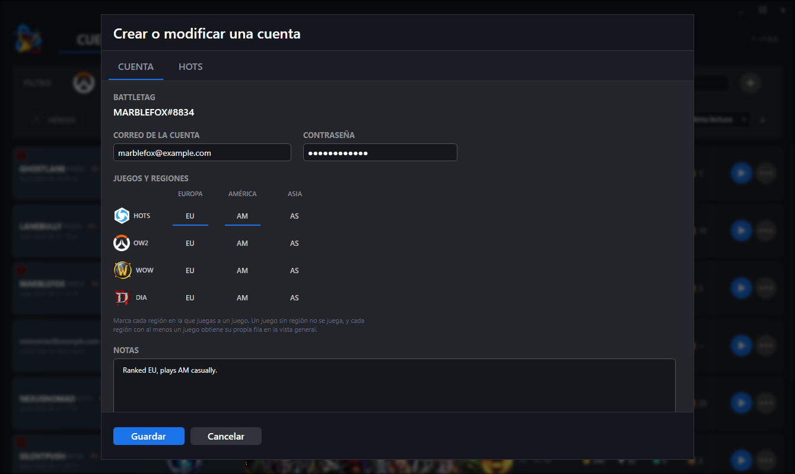

## Heroes of the Storm
* **Inicia y conéctate.** Elige una cuenta desde el menú de inicio de la fila — la aplicación
  abre el juego, selecciona la región de esa fila y escribe las credenciales por ti. Las tres
  regiones funcionan; el juego olvida el ajuste en cada inicio y tras cada cierre de sesión, así
  que la aplicación lo establece cada vez.

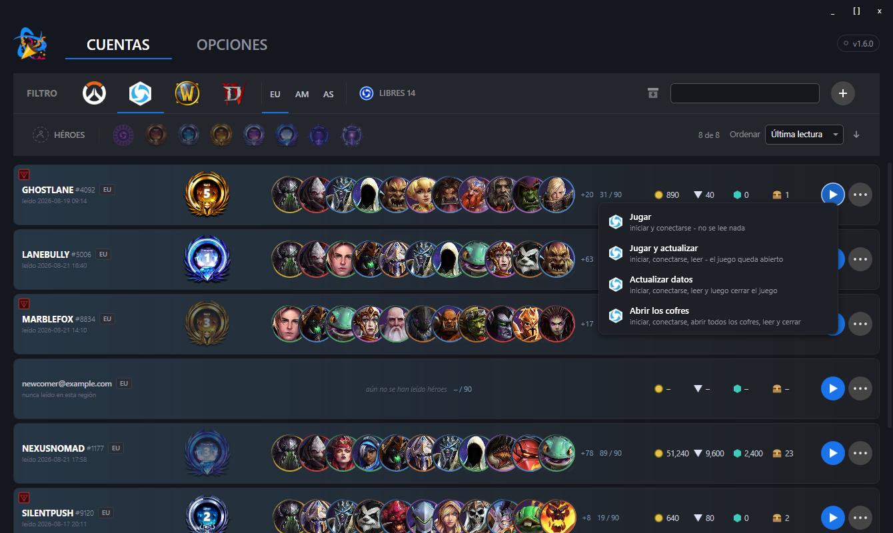

  Las cuatro opciones son cuatro tareas distintas, no cuatro formas de hacer la misma. *Jugar*
  inicia el juego y ahí se detiene — si te has sentado a jugar, no quieres que la aplicación siga
  haciendo clic en menús durante el próximo minuto. Las otras tres leen la cuenta después, y solo
  se diferencian en lo que ocurre a continuación.
* **Lee la cuenta automáticamente.** El rango y la división de la Liga de la Tormenta, las
  partidas de clasificación pendientes, el nivel de jugador, los héroes adquiridos, el oro, las
  esquirlas, las gemas y los cofres sin abrir — **todo lo lee la aplicación directamente de la
  pantalla del juego** y lo guarda de inmediato en el registro de la región en la que iniciaste
  sesión. No hay nada que confirmar, ni que copiar a mano; después aparece un aviso que enumera
  cada valor que cambió.

  Eso es lo que rellena la pestaña de abajo. Aún puedes corregir cualquier valor a mano — pero
  rara vez hace falta, y un campo que la aplicación no pudo leer se deja como está, en vez de
  sobrescribirlo con una suposición.

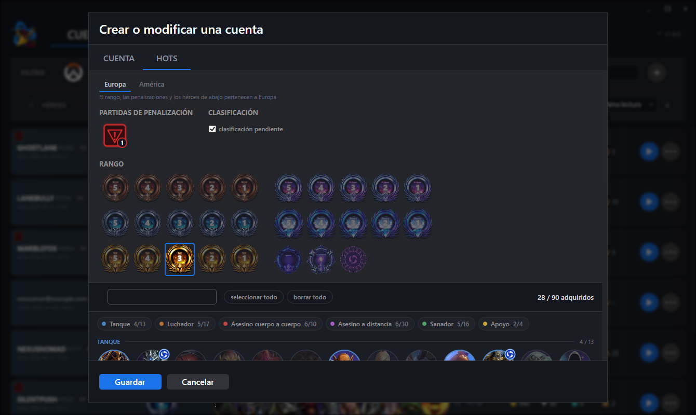

  Todo lo que hay en esa pestaña pertenece a **una sola** región; el selector de arriba indica
  cuál. Si juegas en dos, mantienes dos.
* **Abre los cofres.** Primero abre todos los cofres pendientes, así que las cifras que siguen
  son las de después de abrirlos, no las de antes.
* **Rotación libre de héroes.** La rotación se repite según un calendario anual, y ese calendario
  viene incluido en la aplicación — sin mantenimiento, sin fuente externa, sin nada que descargar.

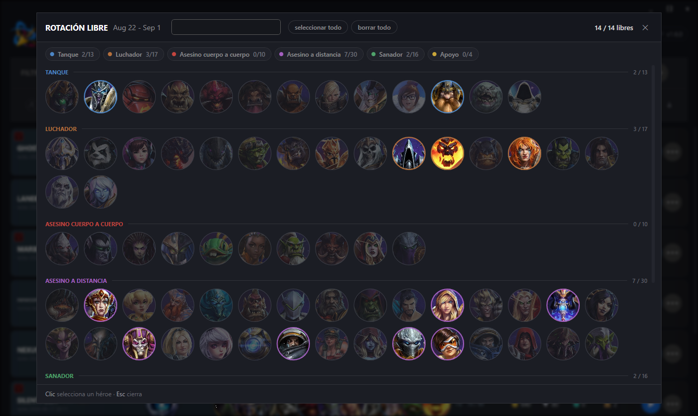

* **Filtra por héroe.** Elige uno o varios y la lista conserva toda cuenta que posea **alguno**
  de ellos, o que pueda jugarlo porque está libre este periodo. El anillo alrededor de cada
  retrato indica el rol del héroe, y la pequeña insignia del Nexo marca los que están libres
  ahora mismo.

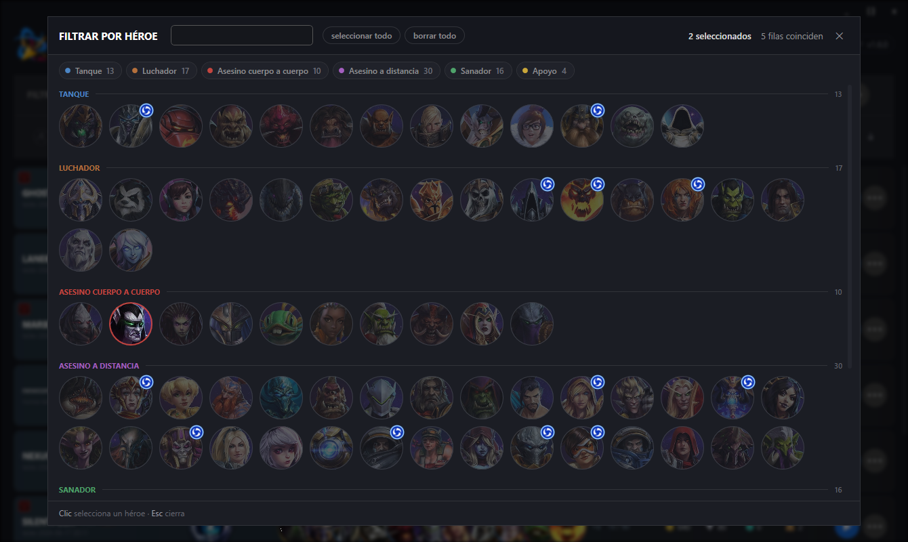

  Dos héroes elegidos, quedan cuatro filas de ocho:

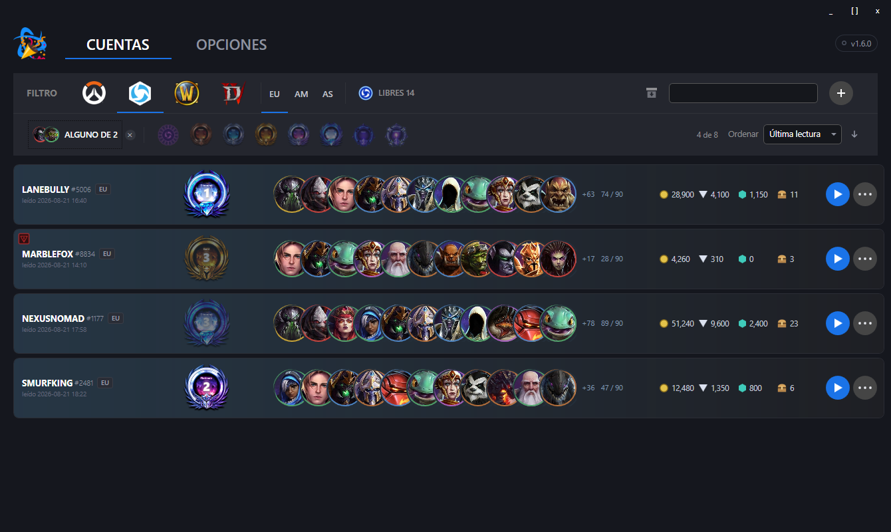

* **Contador de partidas de penalización** por cuenta — clic izquierdo suma una, clic derecho
  resta una — y se lee del juego junto con todo lo demás.

Todo se lee mirando la ventana del juego y reconociendo el texto que hay en ella. Sin lectura de
memoria, sin inyección, sin claves de API, nada que toque los servidores de Blizzard más allá de
un inicio de sesión normal.

## Qué necesita la lectura

Dos cosas de tu cliente del juego deciden si la aplicación puede leerlo: **el idioma de sus
textos** y **el tamaño de su ventana**. Ambas están detalladas aquí por completo, porque un valor
equivocado en cualquiera de las dos es silencioso — nada falla, nada queda registrado,
simplemente no se lee nada.

### Idioma del cliente

Heroes of the Storm ofrece cinco idiomas de texto en **Options → Language and Region → Text
Language** (la segunda lista; la primera solo cambia las voces y aquí no importa). La aplicación
compara lo que lee con las palabras que ese idioma pone en pantalla:

| Idioma del texto en el juego | Compatible |
|---|---|
| `Deutsch` | ✅ **sí** — el predeterminado, y con el que se midió todo |
| `English (US)` | ✅ **sí** — comprobado palabra por palabra contra un cliente en marcha |
| `Français` | ✅ **sí** — medido contra un cliente en marcha, incluidos los 16 nombres de héroes que difieren |
| `Español (ES)` | ✅ **sí** — medido contra un cliente en marcha |
| `Español (AL)` | ✅ **sí** — medido; diez nombres de héroes difieren de la versión de España |

**Indícale a la aplicación cuál de los cinco usas** — Opciones → Idioma del cliente. Los nombres de
los héroes, los niveles de rango y las etiquetas de pantalla se comparan con las palabras que
muestra el cliente, así que un desajuste hace que no se lea absolutamente nada. Donde no se
reconoce nada, no se escribe nada: la aplicación deja las cifras de ayer tal cual, en lugar de
sustituirlas por algo incorrecto.

> **Dos huecos fuera del alemán y el inglés.** La palabra que el juego muestra mientras las
> partidas de clasificación siguen pendientes no se ha medido en francés ni en español, y de los
> niveles de rango solo se verificó el que tenía la cuenta de prueba — el resto sigue el orden
> habitual de la escala y podría no ser exacto. Si un rango o una clasificación pendiente no se
> detecta en esos idiomas, es por eso; todo lo demás se lee con normalidad.

Para obtener el mejor resultado, instala el paquete de idioma de Windows que corresponda al
idioma de tu cliente. El reconocimiento de texto usa lo que Windows tenga instalado; sin el
paquete correspondiente, recurre a otro idioma, lo que sigue funcionando con alfabeto latino pero
se vuelve menos fiable con palabras acentuadas.

El cambio se hace **en el juego**, no aquí — y necesita reiniciar, además de una descarga la
primera vez que eliges un idioma que nunca se había instalado.

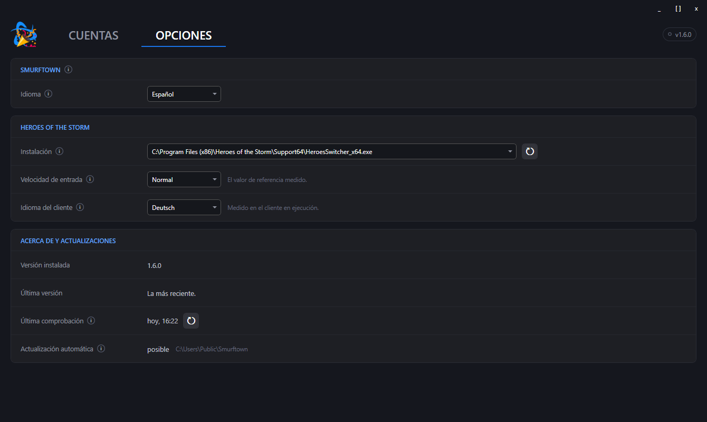

Los ajustes se guardan a medida que los cambias; no hay botón de guardar en ninguna parte de esta
aplicación. En la misma pestaña la aplicación encuentra tu instalación de Heroes of the Storm —
busca por sí sola en los lugares habituales, y *Scan all drives* está ahí para cuando la tuya
está en algún sitio poco común.

### Resolución de pantalla

La aplicación no recuerda coordenadas; recuerda **anclas** — un borde o un centro, más una
distancia desde ahí — y escala esas distancias según la **altura** de la ventana. El ancho solo
decide a qué borde se pega cada elemento, así que *cualquier* ancho con una altura dada se
comporta igual.

| Resolución | Lectura desde el juego |
|---|---|
| 3440 × 1440 | ✅ **sí** — la referencia con la que se midió todo |
| 2560 × 1080 | ✅ **sí** — medido |
| 1920 × 1080 | ✅ **sí** — medido |
| cualquier otra altura | sin probar — probablemente funcione, pero nadie lo ha comprobado |
| cualquier otro ancho con 1440 u 1080 | ✅ igual que la fila de arriba, el ancho no entra en el cálculo |

Tanto en ventana como en pantalla completa sin bordes funciona; la aplicación mide el área
cliente, no el marco de la ventana. **El Escritorio remoto no funciona** — la sesión toma la
resolución de la máquina desde la que te conectas, no la del equipo donde corre el juego, y todas
las medidas salen mal.

## Updates

Una vez a la hora, mientras está abierta, Smurftown le pregunta a GitHub si existe una versión
más reciente. La petición es anónima y no lleva nada sobre ti, sobre tus cuentas ni sobre lo
que hayas hecho con ellas: es la misma pregunta que cualquiera puede hacerle a un repositorio
público. Si hay algo más nuevo, la insignia de versión de la esquina superior derecha lo
indica; un clic abre esto:

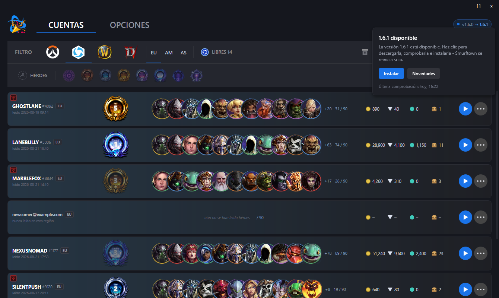

**Instalar** descarga la versión, la comprueba contra la suma SHA-256 publicada y la coloca en su
sitio; la aplicación se reinicia sola. Donde **no** puede reemplazar su propio archivo — una
instalación bajo `Program Files`, una carpeta sin permiso de escritura, una compilación salida
directamente del entorno de desarrollo — el botón abre la página de versión en su lugar y dice
por qué. Cuál de los dos casos es el tuyo aparece en **Opciones → Acerca de y actualizaciones**.

**La suma de comprobación demuestra menos de lo que parece.** El hash y el archivo vienen de
la misma versión por la misma conexión, así que responde a una pregunta — ¿es este el archivo
que la versión dice que es? — y no a la otra: quién lo compiló. Aquí no hay nada firmado,
véase más abajo.

**No hay ningún interruptor para desactivar la comprobación, y es deliberado.** Un ajuste que
nadie encuentra no es consentimiento; lo honesto es enunciar la petición con claridad, que es lo
que hace esta sección. Si no quieres tráfico saliente alguno, bloquea la aplicación en tu
cortafuegos: la comprobación falla en silencio y todo lo demás sigue funcionando.

# Instalación

Descarga `Smurftown_<version>_win-x64.zip` desde
[Releases](https://github.com/tibbots/smurftown/releases), descomprímelo donde quieras y ejecuta
`Smurftown.exe`. No hay nada que instalar: la aplicación guarda todo en
`C:\Users\YOUR_USER\.smurftown` y no toca el resto de tu equipo.

**Necesitas el .NET 8 Desktop Runtime.** Descárgalo desde
[dot.net/download](https://dotnet.microsoft.com/download/dotnet/8.0) — *Desktop Runtime*, x64.
Sin él, Windows dirá que la aplicación no puede iniciarse.

**Windows te avisará.** La descarga no está firmada con un certificado en el que Microsoft
confíe, así que SmartScreen muestra *"Windows protected your PC"*. Elige **More info** →
**Run anyway**.

Cada versión también incluye un `checksums.txt`. Para comprobar lo que descargaste, en
PowerShell:

```powershell
Get-FileHash .\Smurftown_1.0.0_win-x64.zip -Algorithm SHA256
```

Requisitos:

| | |
|---|---|
| Windows | 10 build 19041 (mayo de 2020) o posterior — la aplicación usa el reconocimiento de texto integrado en Windows |
| Runtime | .NET 8 Desktop Runtime, x64 — **instálalo tú mismo**, ver arriba |
| Permisos | usuario normal — **sin derechos de administrador** |

# Hoja de ruta
* Ejecutar varias cuentas una tras otra, con pausas entre inicios de sesión y una parada en la
  primera que falle
* Gestionar una solicitud de verificación en dos pasos en lugar de toparse con el tiempo de
  espera agotado
* Detalles de cuenta para Overwatch, World of Warcraft y Diablo — hoy esas filas solo muestran
  que el juego está marcado

# Preguntas frecuentes

### ¿Dónde puedo descargar la aplicación?
Desde [Releases](https://github.com/tibbots/smurftown/releases).

### ¿Esta aplicación envía o recibe datos de algún servidor en internet?
Una vez a la hora le pregunta a `api.github.com` si existe una versión más reciente, de forma
anónima y sin nada sobre ti ni sobre tus cuentas en la petición. Si aceptas la oferta, también
descarga esa versión desde GitHub. Ese es todo el tráfico que esta aplicación genera por su
cuenta; véase [Updates](#updates). Todo lo demás ocurre en esta máquina, y lo único que sale
aparte de eso es el propio inicio de sesión del juego, escrito en la propia pantalla de inicio
de sesión del juego.

### ¿Dónde se guardan entonces mis datos?
Solo en archivos locales, dentro de la carpeta `.smurftown` de tu directorio personal
(`C:\Users\YOUR_USER\.smurftown`). Tu lista de cuentas vive en `data.yaml`.

**Las contraseñas se guardan en texto plano.** Eso es lo que permite copiarlas y escribirlas
automáticamente, y es la contrapartida deliberada que asume esta aplicación — trata esa carpeta
como lo que es: un almacén de contraseñas.

### ¿Por qué una misma cuenta aparece más de una vez?
Son sus regiones. Una cuenta obtiene una fila por cada región en la que juega, porque el rango,
los héroes y las monedas difieren entre ellas — el mismo battletag puede ser Platino en Europa y
Bronce en América. La insignia `EU`, `AM` o `AS` junto al battletag indica de qué fila se trata, y
el filtro de región de la barra de herramientas muestra una región a la vez.

### ¿Cómo puedo estar seguro de que no me estás mintiendo?
No puedes. Lee el código fuente y decide por ti mismo.

### ¿Por qué Windows me avisa cuando la ejecuto?
Porque el ejecutable no está firmado con un certificado de firma de código, y uno en el que
Microsoft confíe cuesta un dinero que este proyecto no tiene. El aviso es honesto: Windows
realmente no puede saber quién creó el archivo. Si eso te preocupa, compílalo tú mismo desde el
código fuente — `.\dev.cmd release` genera el mismo ZIP que la versión publicada.

### ¿Por qué necesita ver la ventana del juego?
Porque ahí es el único lugar donde existen esos datos. Blizzard no ofrece ninguna interfaz
pública para la propiedad de héroes, el rango o las monedas, así que la aplicación abre las
pantallas correspondientes, toma una captura y lee el texto que hay en ella — igual que harías
tú, solo que más rápido y sin tener que escribir.

### ¿Necesita derechos de administrador?
No, basta con una cuenta de usuario normal. Heroes of the Storm trae su propia pantalla de inicio
de sesión cuando lo inicias directamente, así que la aplicación nunca tiene que tocar nada fuera
de tu directorio personal.
