# Battledeck

[English](README.md) · [Deutsch](README.de.md) · **Français** · [Español](README.es.md)

Gérez tous vos comptes Battle.net au même endroit — et laissez l'application démarrer Heroes of
the Storm pour un compte, s'y connecter, et lire le rang, les héros et les monnaies directement
depuis la partie en cours.

Windows uniquement. Pas de compte, pas de télémétrie, aucune donnée vous concernant ailleurs que
sur votre machine : tout est conservé dans `C:\Users\YOUR_USER\.smurftown`. L'application émet
**exactement une** requête, une fois par heure — elle demande à GitHub s'il existe une version plus
récente. [Ce que c'est, et ce que ce n'est pas](#updates).

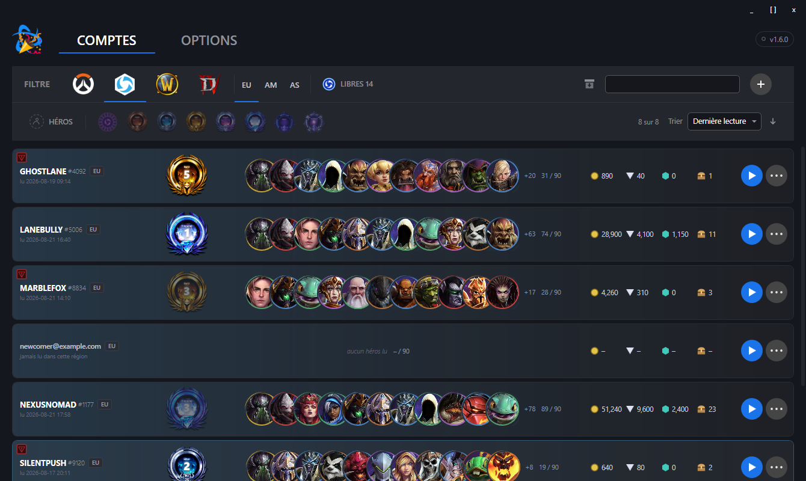

Une ligne par compte et par région. **Le rang, les héros, l'or, les éclats, les gemmes et les
coffres de cette ligne n'ont pas été saisis à la main — l'application les a lus directement dans
la partie en cours.** Tout ce qui suit explique comment.

> Chaque capture d'écran de cette page a été réalisée avec des comptes de démonstration inventés.
> Aucun battletag et aucune adresse ici n'appartient à qui que ce soit.

# Fonctionnalités principales

## Comptes
* Ajoutez et modifiez des comptes Battle.net — une ligne par compte, triable et filtrable
* Enregistrez les identifiants de connexion et copiez l'e-mail ou le mot de passe en un clic
* **Le mot de passe est facultatif.** Laissez-le vide et tout continue de fonctionner, sauf le
  démarrage automatique — connectez le compte vous-même dans Heroes of the Storm, puis relisez-le
  avec le bouton décrit plus bas. Seul le menu de démarrage de la ligne disparaît : sans mot de
  passe, il n'a plus rien à proposer à saisir dans l'écran de connexion du jeu.
* Archivez les comptes que vous n'utilisez plus au lieu de les supprimer — **il n'y a pas de
  bouton de suppression**, et c'est voulu : un clic malheureux dans une liste de lignes qui se
  ressemblent toutes ne doit pas être la dernière étape
* **Recréer un compte sous une adresse e-mail déjà archivée le restaure au lieu de le
  dupliquer.** Son battletag, son rang, ses héros et chaque région jamais cochée sont conservés ;
  seul ce que vous saisissez ou lisez réellement cette fois-ci les remplace.
* Filtrez par nom, par jeu ou par héros
* **Filtrez par rang et triez la liste.** Pour Heroes of the Storm, huit puces de rang — Sans
  rang jusqu'à Grand Maître — réduisent la liste à un ou plusieurs rangs à la fois ; *Sans rang*
  couvre aussi bien un compte jamais lu qu'un compte lu sans rang défini. À côté, un contrôle de
  tri (dernière lecture, nom, rang, or, héros lus, avec un clic pour inverser le sens) et un
  compteur de comptes correspondants restent disponibles pour chaque jeu, pas seulement Heroes of
  the Storm.
* **Une liste vide s'explique d'elle-même.** Pas encore de compte ? La fenêtre montre les deux
  façons de la remplir plutôt qu'une zone vide : en saisir un à la main avec son e-mail et son
  mot de passe, ou lancer Heroes of the Storm vous-même et vous connecter — Battledeck le lit dans
  le jeu à cet instant.

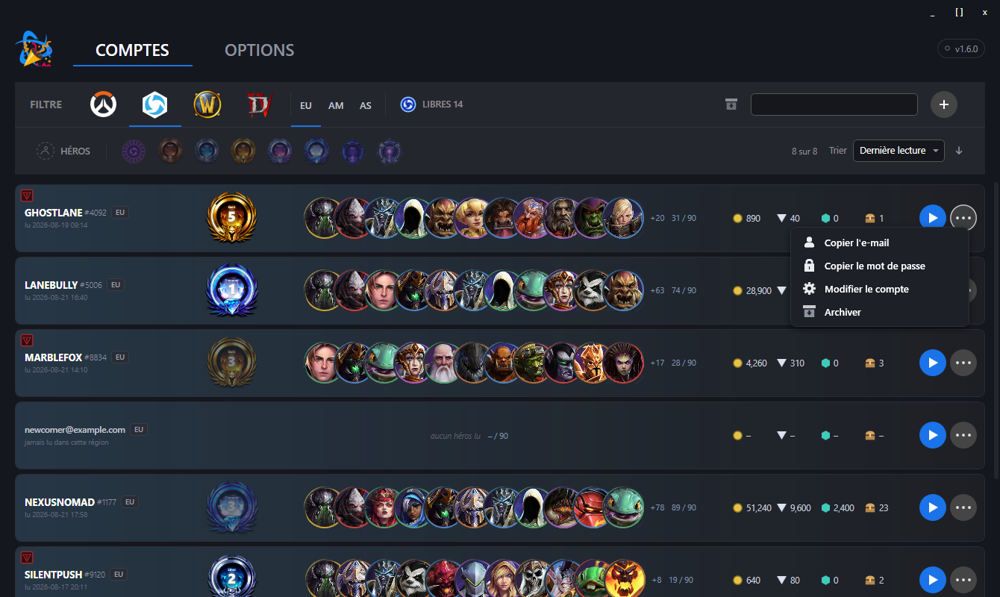

Un compte archivé ne disparaît pas, il se met simplement de côté. Le bouton de la barre d'outils
affiche cette moitié de la liste à la place, et le même bouton sur la ligne permet de restaurer un
compte.

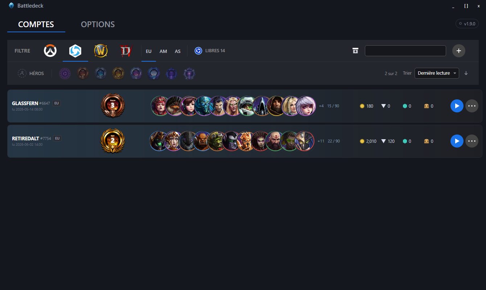
* Indiquez à quels jeux joue un compte : Heroes of the Storm, Overwatch, World of Warcraft, Diablo
* **Choisissez les régions dans lesquelles joue un compte.** La progression dans Heroes of the
  Storm est liée à la région, si bien qu'un compte qui joue à la fois en Europe et dans les
  Amériques a deux rangs, deux collections de héros et deux totaux d'or. Chaque région cochée
  obtient sa propre ligne, et le filtre de région bascule entre elles.

**Le filtre de jeu est une vue, pas un simple filtre.** Choisissez Overwatch et chaque ligne
affiche ce qui est connu à son sujet — ce qui, aujourd'hui, n'est rien, et l'application le dit
plutôt que de faire semblant.

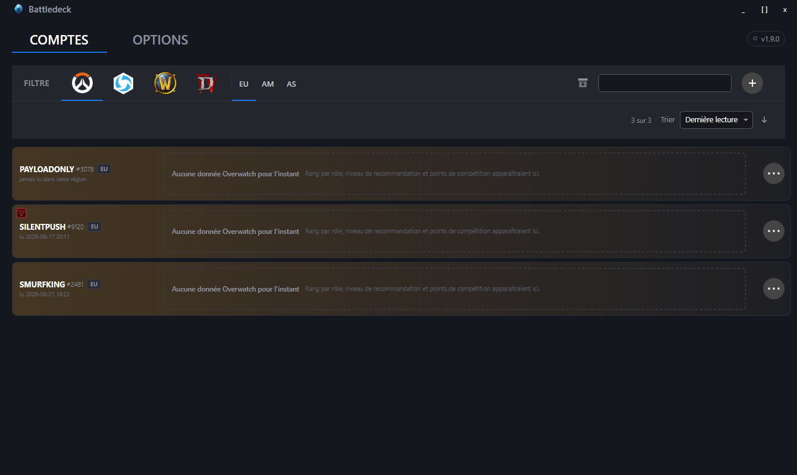

**Le filtre de région bascule entre les lignes d'un même compte.** Ci-dessous, ce sont les mêmes
battletags que plus haut, mais côté Amériques : rang différent, héros différents, or différent.
`HALFMOONBAY` a la région Amériques cochée et n'y a jamais été lu, il affiche donc des tirets au
lieu de zéros — un zéro affirmerait que le compte ne possède rien, et ce n'est pas quelque chose
que nous savons.

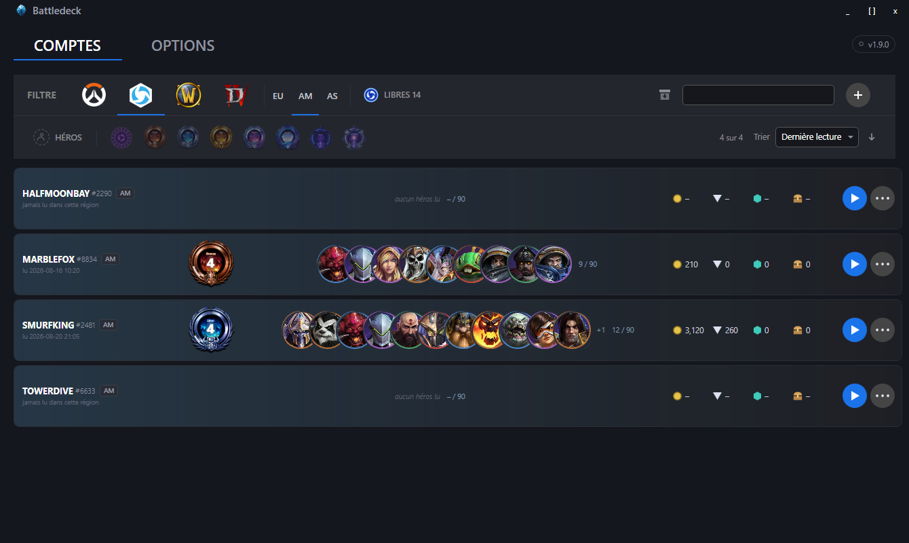

**Tout ce qui concerne un compte se trouve dans une seule boîte de dialogue.** Le battletag est
affiché, pas saisi : il est lu depuis le jeu, dès la première lecture du compte.

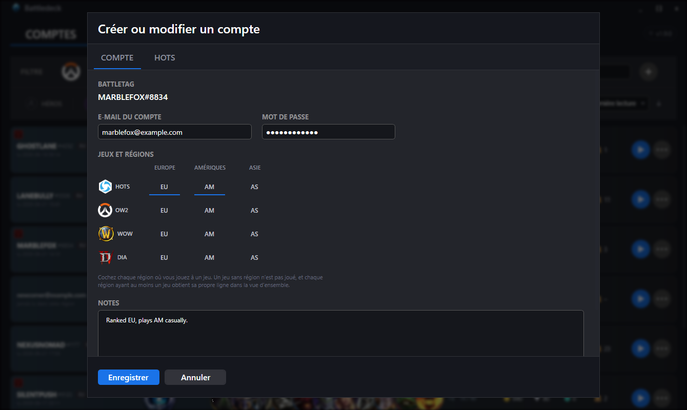

## Heroes of the Storm
* **Démarrez et connectez-vous.** Choisissez un compte dans le menu de démarrage de la ligne —
  l'application lance le jeu, sélectionne la région de cette ligne et saisit les identifiants à
  votre place. Les trois régions fonctionnent ; le jeu oublie ce réglage à chaque démarrage et
  après chaque déconnexion, l'application le redéfinit donc à chaque fois.

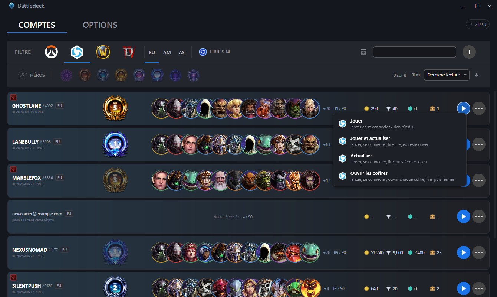

  Les quatre entrées sont quatre tâches différentes, pas quatre façons de faire la même chose.
  *Jouer* lance le jeu et s'arrête là — si vous vous installez pour jouer, vous ne voulez pas que
  l'application continue à cliquer dans les menus pendant la minute qui suit. Les trois autres
  lisent ensuite le compte et ne diffèrent que par ce qui se passe après.
* **Lisez le compte, automatiquement.** Le rang et la division en Ligue Storm, les parties de
  placement en attente, le niveau du compte, les héros possédés, l'or, les éclats, les gemmes et
  les coffres non ouverts — **tout est lu à l'écran par l'application** et inscrit directement
  dans les données de la région où vous vous êtes connecté. Rien à confirmer, rien à recopier à la
  main ; un message affiché ensuite indique chaque valeur qui a changé.

  C'est ce qui remplit l'onglet ci-dessous. Vous pouvez toujours corriger n'importe quelle valeur
  vous-même — mais vous en aurez rarement besoin, et un champ que l'application n'a pas pu lire
  reste inchangé plutôt que d'être écrasé par une supposition.

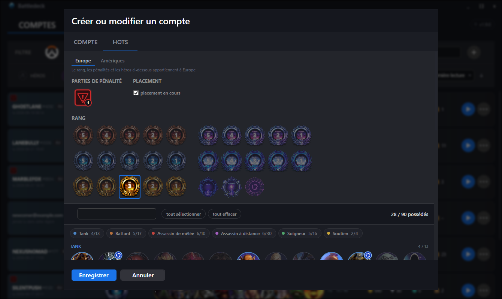

  Tout ce qui figure dans cet onglet appartient à **une seule** région ; le sélecteur en haut
  indique laquelle. Si vous jouez dans deux régions, vous en gérez deux.
* **Ou sautez le menu de démarrage — lisez qui est déjà connecté.** Dès que Heroes of the Storm
  est lancé, un bouton apparaît en haut de la fenêtre de Battledeck. Cliquez dessus et
  l'application lit ce compte de la même façon, sans toucher à la connexion du jeu lui-même :
  elle ne déconnecte personne et ne ferme rien. Connectez-vous avec un battletag que Battledeck
  n'a encore jamais vu, et le bouton crée le compte sur-le-champ au lieu de le refuser — aucun
  mot de passe enregistré, aucun e-mail saisi, aucune question posée.
* **Ouvrez les coffres.** Ouvre d'abord tous les coffres non ouverts, si bien que les chiffres qui
  suivent sont ceux d'après l'ouverture, pas d'avant.
* **Rotation libre des héros.** La rotation se répète sur un calendrier annuel, et ce calendrier
  est fourni avec l'application — aucune maintenance, aucune source externe, rien à récupérer.

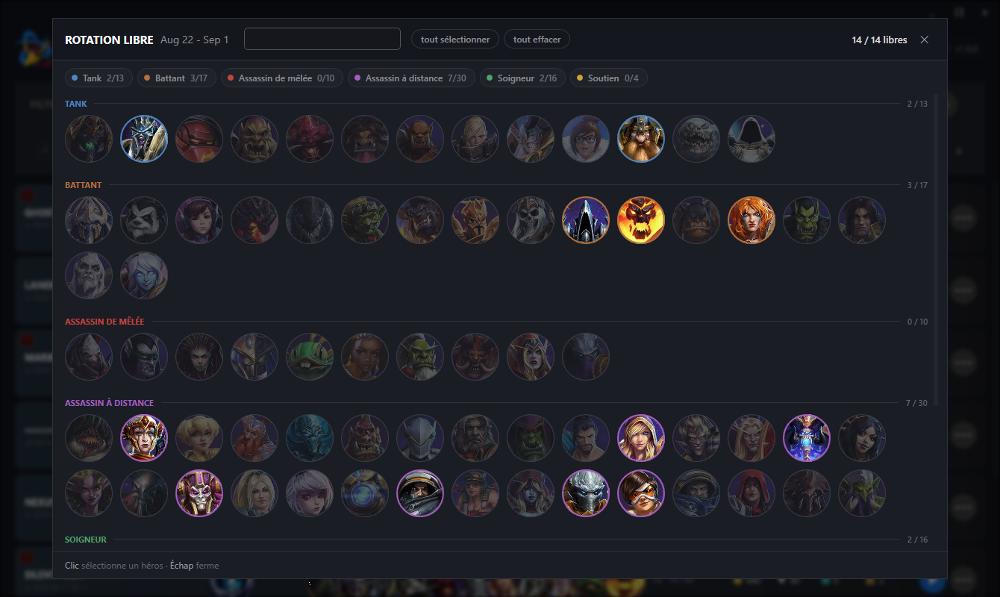

* **Filtrez par héros.** Choisissez-en un ou plusieurs et la liste ne garde que les comptes qui
  possèdent l'un d'entre eux — ou peuvent le jouer gratuitement cette période. L'anneau autour de
  chaque portrait indique le rôle du héros, et le petit badge du Nexus marque ceux qui sont libres
  cette période.

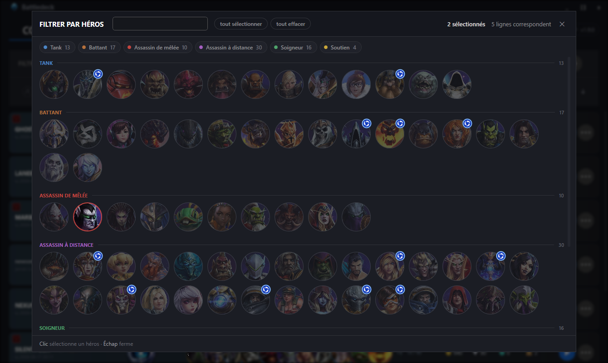

  Deux héros choisis, il reste quatre lignes sur huit :

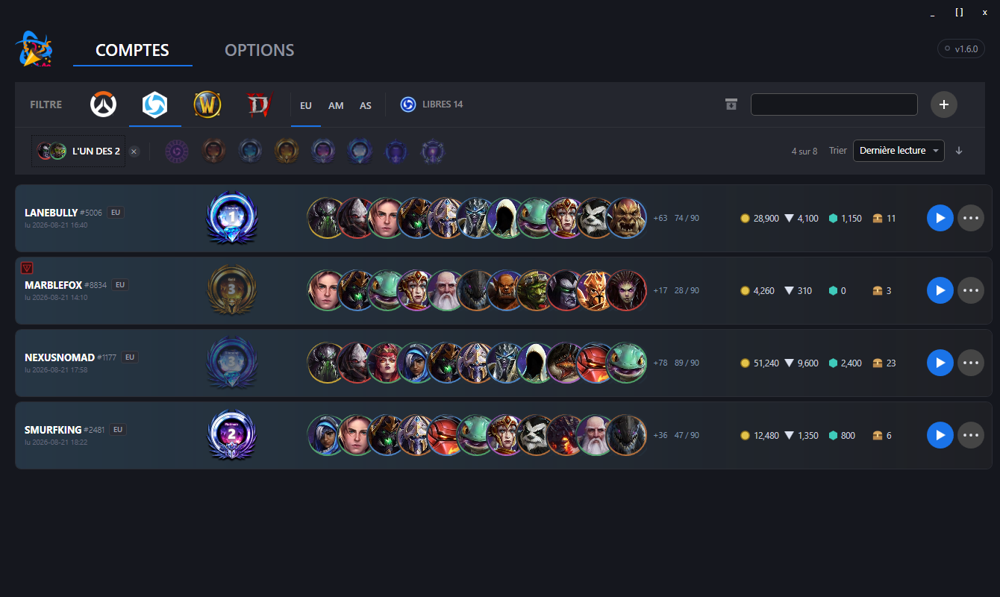

* **Compteur de parties de pénalité** par compte, clic gauche pour l'augmenter, clic droit pour
  la diminuer — et lu dans le jeu comme tout le reste.

Tout est lu en observant la fenêtre du jeu et en reconnaissant le texte qui s'y trouve. Aucune
lecture de mémoire, aucune injection, aucune clé d'API, rien qui touche aux serveurs de Blizzard
au-delà d'une connexion normale.

## Ce dont la lecture a besoin

Deux choses concernant votre client de jeu déterminent si l'application peut le lire : **la langue
de ses textes** et **la taille de sa fenêtre**. Les deux sont détaillées ici intégralement, car
une mauvaise réponse à l'une ou l'autre reste silencieuse — rien ne plante, rien n'est journalisé,
tout simplement rien n'est lu.

### Langue du client

Heroes of the Storm propose cinq langues de texte sous **Options → Language and Region → Text
Language** (la deuxième liste ; la première ne change que les voix et n'a pas d'importance ici).
L'application compare ce qu'elle lit aux mots que cette langue affiche à l'écran :

| Langue des textes dans le jeu | Prise en charge |
|---|---|
| `Deutsch` | ✅ **oui** — la langue par défaut, celle sur laquelle tout a été mesuré |
| `English (US)` | ✅ **oui** — vérifiée mot à mot sur un client en cours d'exécution |
| `Français` | ✅ **oui** — mesurée sur un client en cours d'exécution, avec les 16 noms de héros qui diffèrent |
| `Español (ES)` | ✅ **oui** — mesurée sur un client en cours d'exécution |
| `Español (AL)` | ✅ **oui** — mesurée ; dix noms de héros diffèrent de la version d'Espagne |

**Indiquez à l'application laquelle des cinq vous utilisez** — Options → Langue du client. Les
noms des héros, les paliers de rang et les libellés à l'écran sont comparés aux mots que le
client affiche, donc un mauvais réglage signifie que rien n'est lu du tout. Là où rien n'est
reconnu, rien n'est écrit : l'application laisse les chiffres d'hier tels quels plutôt que de
les remplacer par quelque chose de faux.

> **Deux lacunes en dehors de l'allemand et de l'anglais.** Le mot que le jeu affiche pendant que
> des parties de placement sont encore en cours n'a pas été mesuré en français ni en espagnol,
> et parmi les paliers de rang, seul celui que détenait le compte de test a été vérifié — le
> reste suit l'échelle habituelle et pourrait être inexact. Si un rang ou un placement en cours
> n'est pas détecté dans ces langues, c'est pour cette raison ; tout le reste se lit normalement.

Pour un meilleur résultat, installez le pack de langue Windows correspondant à la langue de
votre client. La reconnaissance de texte utilise ce que Windows propose ; sans le pack
correspondant, elle se rabat sur une autre langue, ce qui fonctionne encore pour l'alphabet latin
mais devient moins fiable sur les mots accentués.

Le changement se fait **dans le jeu**, pas ici — et il nécessite un redémarrage, ainsi qu'un
téléchargement la première fois que vous choisissez une langue jamais installée.

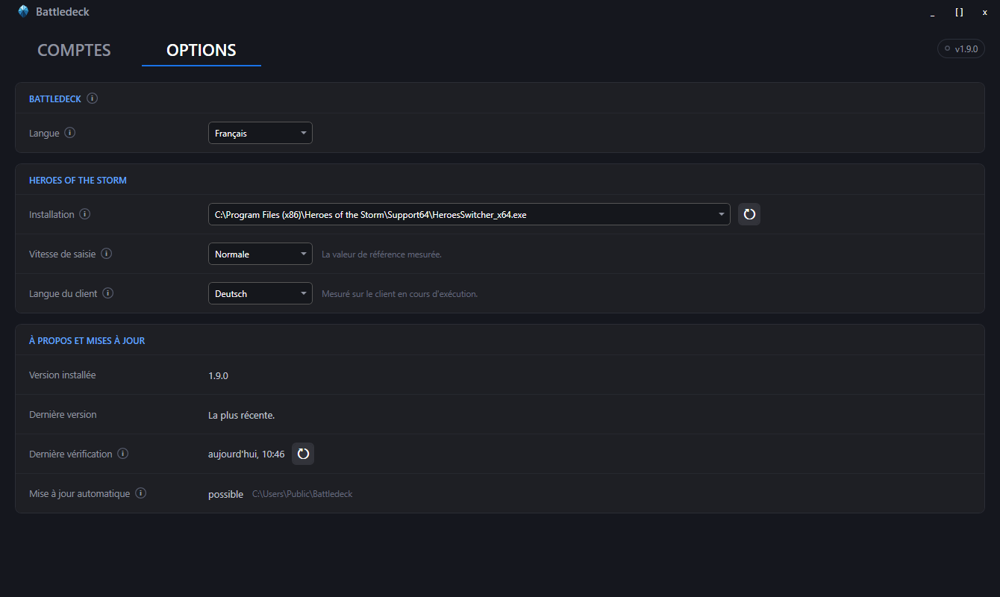

Les réglages sont enregistrés au fur et à mesure ; il n'y a de bouton d'enregistrement nulle part
dans cette application. C'est dans le même onglet que l'application trouve votre installation de
Heroes of the Storm — elle cherche d'abord dans les emplacements habituels, et *Chercher partout*
est là pour quand la vôtre se trouve ailleurs.

### Résolution d'écran

L'application ne mémorise pas de coordonnées ; elle mémorise des **repères** — un bord ou un
centre, plus une distance depuis celui-ci — et met ces distances à l'échelle selon la **hauteur**
de la fenêtre. La largeur détermine seulement à quel bord un élément s'accroche, si bien que
*n'importe quelle* largeur à une hauteur donnée se comporte de façon identique.

| Résolution | Lecture depuis le jeu |
|---|---|
| 3440 × 1440 | ✅ **oui** — la référence sur laquelle tout a été mesuré |
| 2560 × 1080 | ✅ **oui** — mesurée |
| 1920 × 1080 | ✅ **oui** — mesurée |
| toute autre hauteur | non testée — probablement correcte, mais personne ne l'a vérifiée |
| toute autre largeur à 1440, 1080 | ✅ identique à la ligne au-dessus, la largeur n'entre pas dans le calcul |

Le mode fenêtré comme le plein écran sans bordure fonctionnent tous les deux ; l'application
mesure la zone client, pas le cadre de la fenêtre. **Le Bureau à distance, non** — la session
prend la résolution de la machine devant laquelle vous êtes assis, pas celle sur laquelle tourne
le jeu, et chaque mesure devient fausse.

## Updates

Une fois par heure, tant qu'elle est ouverte, Battledeck demande à GitHub s'il existe une
version plus récente. La requête est anonyme et ne transporte rien vous concernant, ni vos
comptes, ni ce que vous en avez fait — c'est la même question que n'importe qui peut poser à
un dépôt public. S'il y a du nouveau, la pastille de version en haut à droite le signale ; un
clic ouvre ceci :

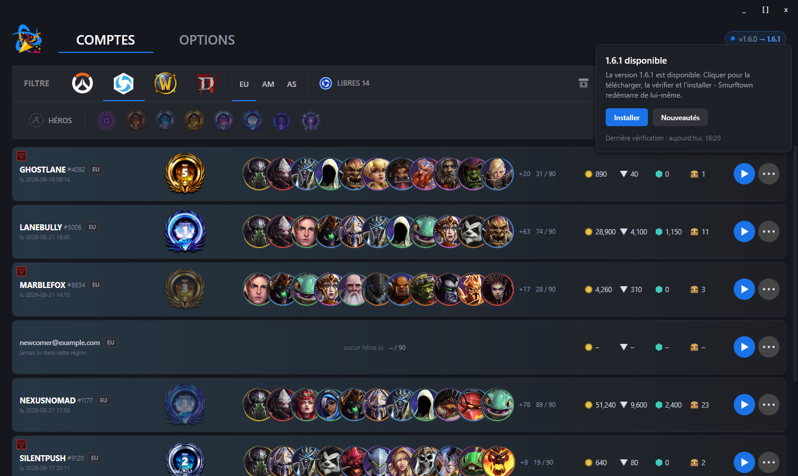

**Installer** télécharge la version, la vérifie contre la somme de contrôle SHA-256 publiée et la
met en place ; l'application redémarre d'elle-même. Là où elle ne peut **pas** remplacer son
propre fichier — une installation sous `Program Files`, un dossier sans droit d'écriture, une
compilation sortie directement de l'environnement de développement — le bouton ouvre la page de
version à la place et en donne la raison. Ce qui s'applique à votre installation est indiqué dans
**Options → À propos et mises à jour**.

**La somme de contrôle prouve moins qu'il n'y paraît.** L'empreinte et le fichier viennent de
la même version par la même connexion ; elle répond donc à une question — est-ce bien le
fichier annoncé par la version — et pas à l'autre : qui l'a compilé. Rien n'est signé ici,
voir plus bas.

**Il n'y a aucun interrupteur pour désactiver cette vérification, et c'est délibéré.** Un réglage
que personne ne trouve ne vaut pas consentement ; l'honnêteté consiste à énoncer la requête
clairement, ce que fait cette section. Si vous ne voulez aucun trafic sortant, bloquez
l'application dans votre pare-feu — la vérification échoue alors en silence et tout le reste
continue de fonctionner.

# Installation

Téléchargez `Battledeck_<version>_win-x64.zip` depuis
[Releases](https://github.com/tibbots/battledeck/releases), décompressez-le où vous voulez et
lancez `Battledeck.exe`. Il n'y a rien à installer : l'application conserve tout dans
`C:\Users\YOUR_USER\.smurftown` et ne touche à rien d'autre sur votre machine.

**Vous avez besoin du .NET 8 Desktop Runtime.** Téléchargez-le depuis
[dot.net/download](https://dotnet.microsoft.com/download/dotnet/8.0) — *Desktop Runtime*, x64.
Sans lui, Windows indique que l'application ne peut pas démarrer.

**Windows va vous avertir.** Le fichier téléchargé n'est pas signé avec un certificat approuvé par
Microsoft, donc SmartScreen affiche *"Windows protected your PC"*. Choisissez **More info** →
**Run anyway**.

Chaque version fournit aussi un fichier `checksums.txt`. Pour vérifier ce que vous avez
téléchargé, dans PowerShell :

```powershell
Get-FileHash .\Battledeck_1.0.0_win-x64.zip -Algorithm SHA256
```

Prérequis :

| | |
|---|---|
| Windows | 10 build 19041 (mai 2020) ou plus récent — l'application utilise la reconnaissance de texte intégrée à Windows |
| Runtime | .NET 8 Desktop Runtime, x64 — **à installer vous-même**, voir ci-dessus |
| Droits | utilisateur standard — **aucun droit administrateur** |

# Feuille de route
* Lancer plusieurs comptes les uns après les autres, avec un délai entre les connexions et un
  arrêt dès le premier échec
* Gérer une demande d'authentification à deux facteurs au lieu de tomber sur le délai
  d'expiration
* Détails de compte pour Overwatch, World of Warcraft et Diablo — aujourd'hui, ces lignes
  indiquent seulement que le jeu est coché

# FAQ

### Où puis-je télécharger l'application ?
Depuis [Releases](https://github.com/tibbots/battledeck/releases).

### Cette application envoie-t-elle ou reçoit-elle des données depuis un serveur sur internet ?
Une fois par heure, elle demande à `api.github.com` s'il existe une version plus récente — de
façon anonyme, sans rien sur vous ni sur vos comptes dans la requête. Si vous acceptez la
proposition, elle télécharge également cette version depuis GitHub. C'est tout le trafic que
cette application produit d'elle-même ; voir [Updates](#updates). Tout le reste se passe sur
cette machine, et la seule autre chose qui en sort, c'est la connexion du jeu lui-même, saisie
dans son propre écran de connexion.

### Où sont donc stockées mes données ?
Uniquement dans des fichiers locaux, dans le dossier `.smurftown` de votre répertoire personnel
(`C:\Users\YOUR_USER\.smurftown`). Votre liste de comptes se trouve dans `data.yaml`.

**Les mots de passe sont stockés en clair.** C'est ce qui permet de les copier et de les saisir
automatiquement, et c'est un compromis délibéré de cette application — traitez ce dossier comme
le gestionnaire de mots de passe qu'il est.

### Ai-je besoin de donner mon mot de passe à Battledeck ?
Non. Laissez le champ du mot de passe vide en ajoutant un compte à la main, ou sautez le dialogue
entièrement — lancez Heroes of the Storm vous-même, connectez-vous et utilisez « Actualiser »
depuis le bouton en haut de la fenêtre : Battledeck crée le compte à partir de ce qu'il lit et ne
voit jamais le mot de passe. La seule chose qui manque sans lui est le démarrage automatique ;
lire le rang, les héros et les monnaies du jeu continue de fonctionner à l'identique.

### Pourquoi un compte est-il listé plusieurs fois ?
Ce sont ses régions. Un compte obtient une ligne par région dans laquelle il joue, car le rang,
les héros et les monnaies y diffèrent — le même battletag peut être Platine en Europe et Bronze
dans les Amériques. Le badge `EU`, `AM` ou `AS` à côté du battletag indique de quelle ligne il
s'agit, et le filtre de région dans la barre d'outils affiche une région à la fois.

### Comment puis-je être sûr que vous ne mentez pas ?
Vous ne pouvez pas. Lisez le code source et jugez par vous-même.

### Pourquoi Windows m'avertit-il quand je le lance ?
Parce que l'exécutable n'est pas signé avec un certificat de signature de code, et qu'un
certificat approuvé par Microsoft coûte de l'argent que ce projet n'a pas. L'avertissement est
honnête : Windows ne peut réellement pas savoir qui a créé ce fichier. Si cela vous gêne,
compilez-le vous-même depuis les sources — `.\dev.cmd release` produit le même ZIP que la version
publiée.

### Pourquoi a-t-elle besoin de voir la fenêtre du jeu ?
Parce que c'est le seul endroit où ces données existent. Blizzard n'offre aucune interface
publique pour la possession des héros, le rang ou les monnaies, donc l'application ouvre les
écrans concernés, en prend une image et lit le texte qui s'y trouve — comme vous le feriez
vous-même, en plus rapide et sans avoir à taper.

### A-t-elle besoin de droits administrateur ?
Non, un compte utilisateur standard suffit. Heroes of the Storm apporte son propre écran de
connexion quand on le démarre directement, donc l'application n'a jamais besoin de toucher à quoi
que ce soit en dehors de votre répertoire personnel.
