# Smurftown

**English** · [Deutsch](README.de.md) · [Français](README.fr.md) · [Español](README.es.md)

Manage all of your Battle.net accounts in one place — and let the app start Heroes of the
Storm for an account, log in, and read rank, heroes and currencies straight out of the running
game.

Windows only. No account, no telemetry, no data about you anywhere but on your machine:
everything lives in `C:\Users\YOUR_USER\.smurftown`. The app makes **exactly one** request,
once an hour — it asks GitHub whether a newer version exists. [What that is, and what it is
not](#updates).

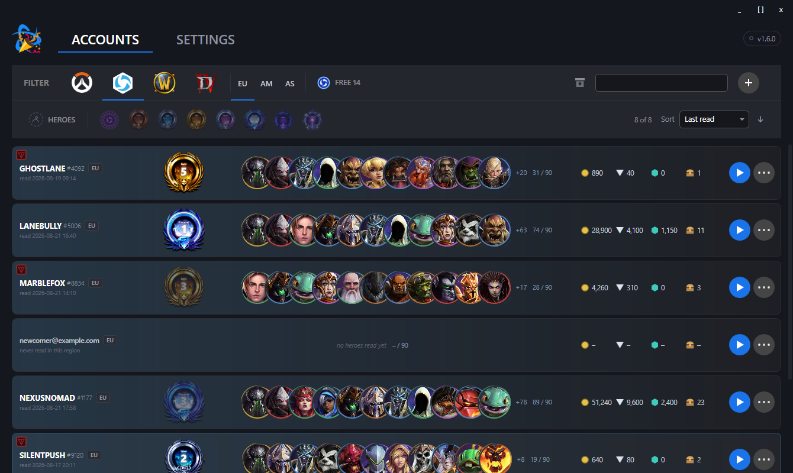

One row per account and region. **Rank, heroes, gold, shards, gems and loot chests in that row
were not typed in — the app read them out of the running game.** Everything below is about how.

> Every screenshot on this page was taken against made-up demo accounts. No battletag and no
> address here belongs to anyone.

# Key Features

## Accounts
* Add and edit Battle.net accounts — one row per account, sorted and filterable
* Store login credentials and copy e-mail or password with a single click
* Archive accounts you stopped using instead of deleting them — **there is no delete button**,
  on purpose: one misclick in a list of look-alike rows should not be the last step
* Filter by name, by game, or by hero
* **Filter by rank and sort the list.** For Heroes of the Storm, eight rank chips — Unranked
  through Grand Master — narrow the list to one or several ranks at once; *Unranked* covers both
  an account never read and one read with no rank set. Next to it, a sort control (last read,
  name, rank, gold, heroes read, with a click to reverse the direction) and a count of matching
  accounts are available for every game, not only Heroes of the Storm.

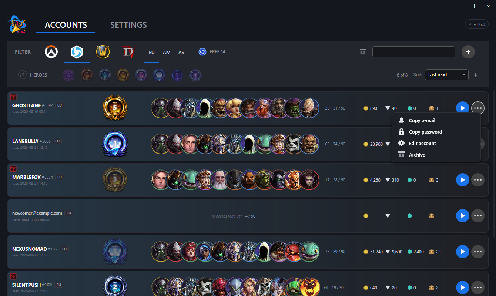

An archived account does not disappear, it moves out of the way. The toggle in the toolbar shows
that half of the list instead, and the same button in the row puts an account back.

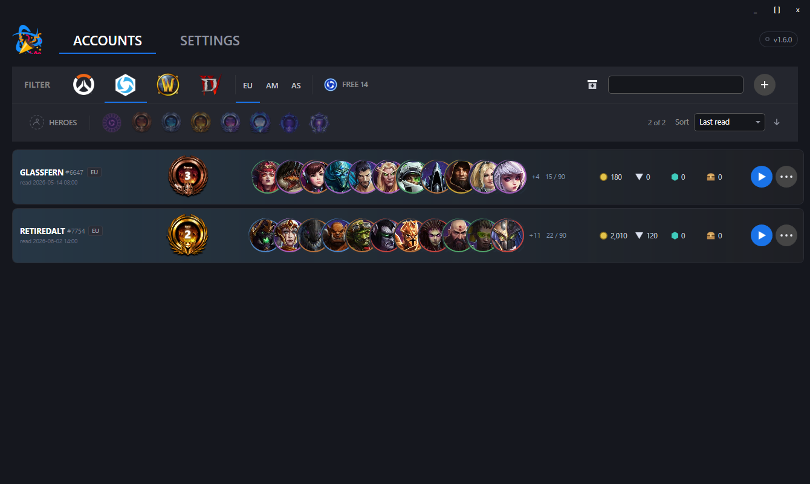
* Mark which games an account plays: Heroes of the Storm, Overwatch, World of Warcraft, Diablo
* **Pick the regions an account plays in.** Progress in Heroes of the Storm is tied to the
  region, so an account that plays in both Europe and the Americas has two ranks, two hero
  collections and two gold counts. Each region you tick gets its own row, and the region filter
  switches between them.

**The game filter is a view, not just a filter.** Pick Overwatch and every row shows what is known
about Overwatch — which today is nothing, and it says so rather than pretending otherwise.

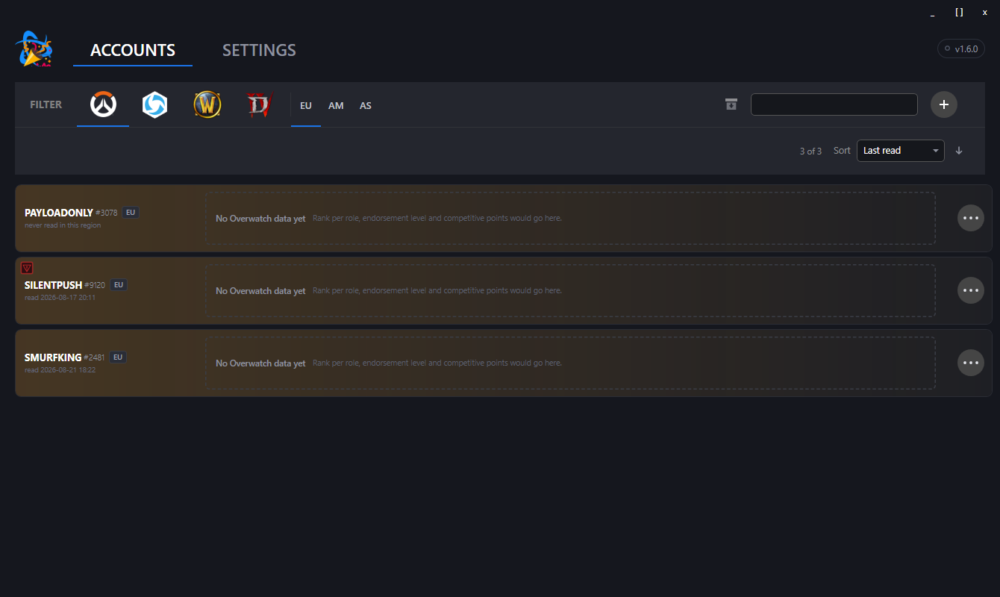

**The region filter switches between the rows of one account.** Below are the same battletags as
further up, but their Americas side: different rank, different heroes, different gold.
`HALFMOONBAY` has Americas ticked and has never been read there, so it shows dashes instead of
zeroes — a zero would claim the account owns nothing, and that is not something we know.

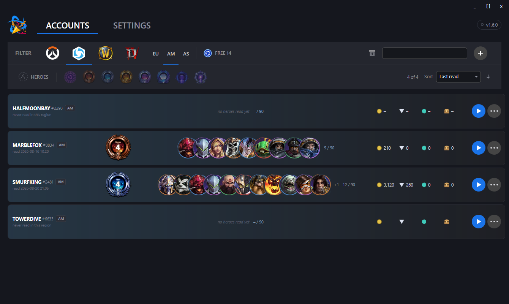

**Everything about one account sits in one dialog.** The battletag is shown, not typed: it comes
out of the game the first time the account is read.

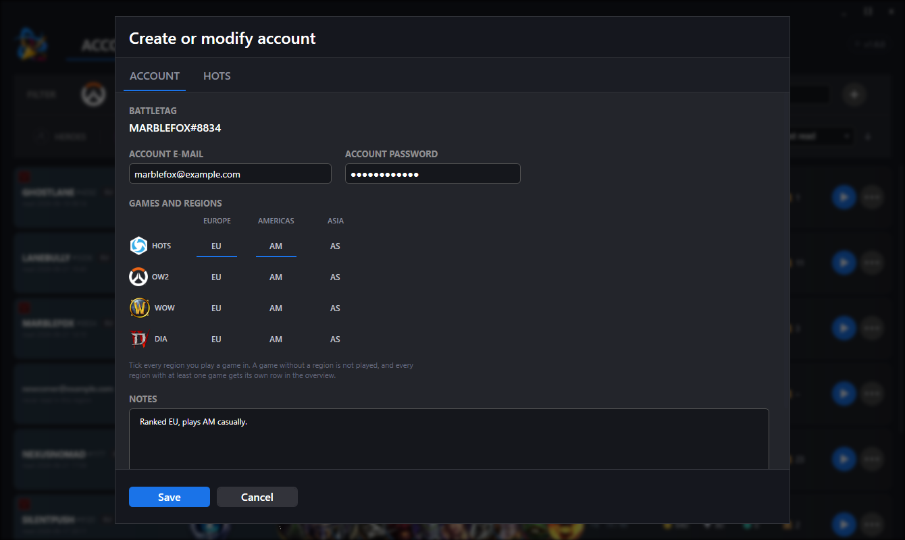

## Heroes of the Storm
* **Start and log in.** Pick an account from the row's start menu — the app launches the game,
  selects the region of that row and types the credentials for you. All three regions work;
  the game forgets the setting on every start and after every sign-out, so the app sets it
  each time.

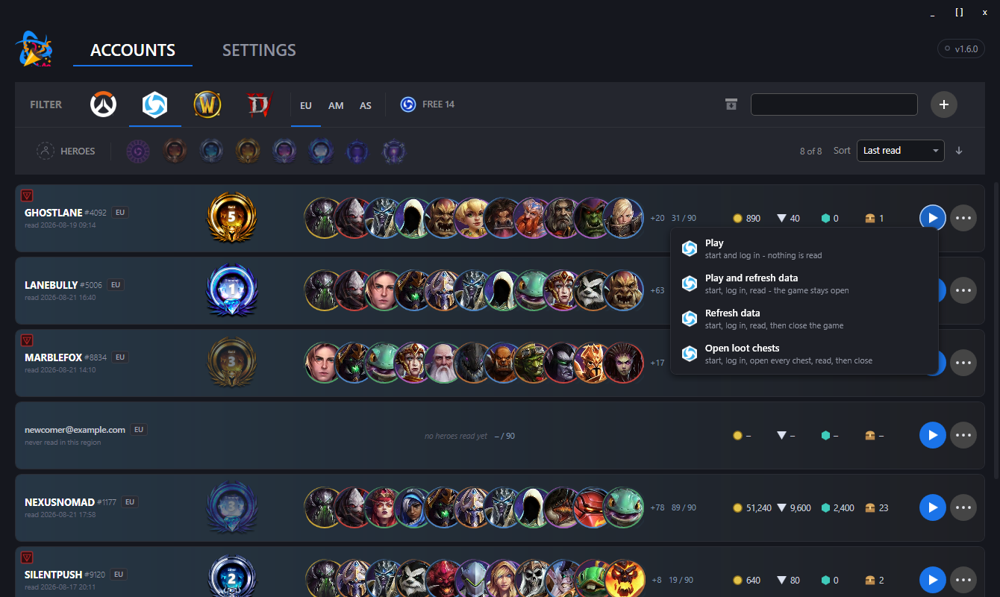

  The four entries are four jobs, not four ways of doing one. *Play* starts the game and stops
  there — if you sat down to play, you do not want the app clicking through menus for the next
  minute. The other three read the account afterwards and differ only in what happens after that.
* **Read the account, automatically.** Storm League rank and division, pending placement
  matches, account level, owned heroes, gold, shards, gems and unopened loot chests — **all of
  it read off the game screen by the app** and written straight into the record of the region
  you signed in to. Nothing to confirm, nothing to copy by hand; a toast afterwards names every
  value that changed.

  That is what fills the tab below. You can still correct any of it yourself — but you rarely
  need to, and a field the app could not read is left alone rather than overwritten with a
  guess.

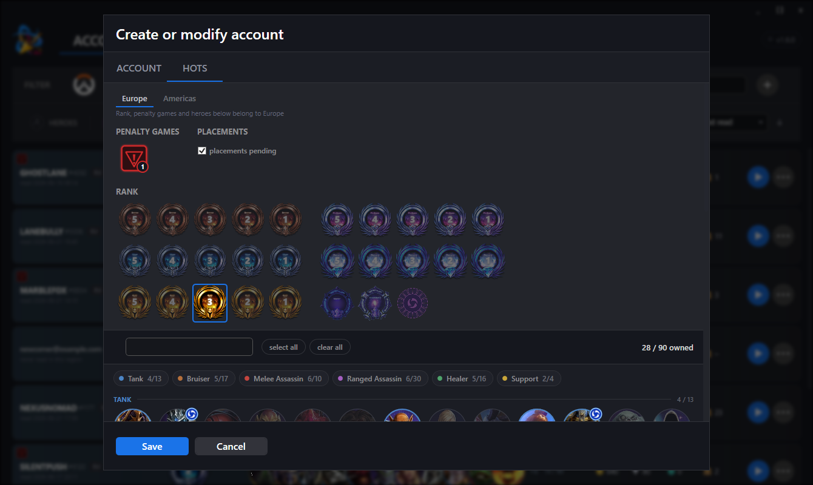

  Everything on that tab belongs to **one** region; the switcher at the top says which. Play in
  two, and you maintain two.
* **Open loot chests.** Opens every unopened chest first, so the numbers that follow are the
  ones after opening, not before.
* **Free hero rotation.** The rotation repeats on a yearly calendar, and that calendar ships
  with the app — no maintenance, no external source, nothing to fetch.

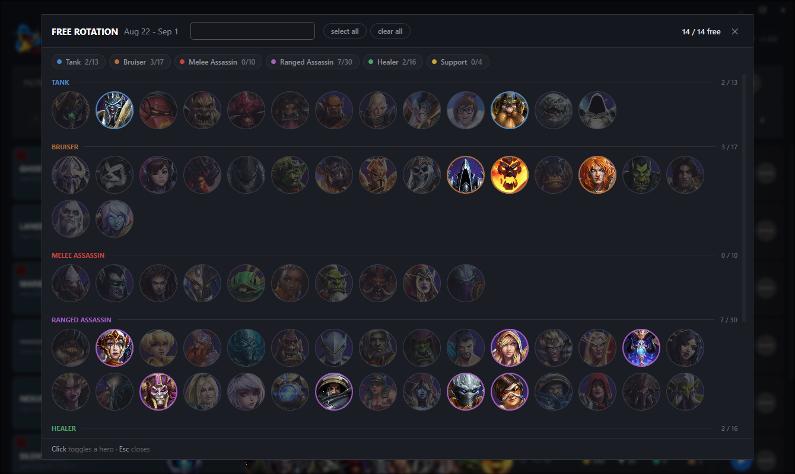

* **Filter by hero.** Pick one or more and the list keeps every account that owns **any** of
  them — or can play them free this period. The ring around each portrait is the hero's role,
  and the small Nexus badge marks the ones that are free right now.

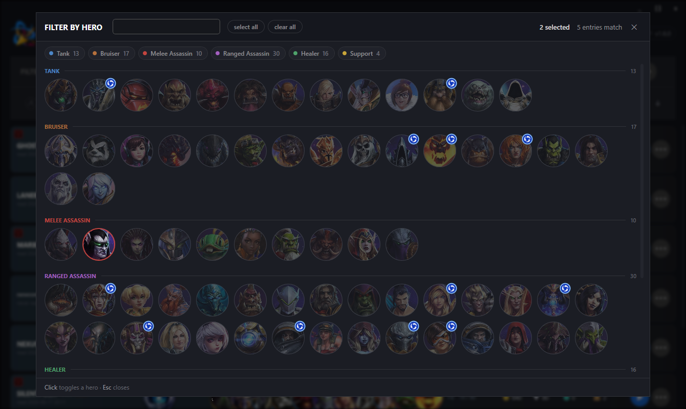

  Two heroes picked, four rows left of eight:

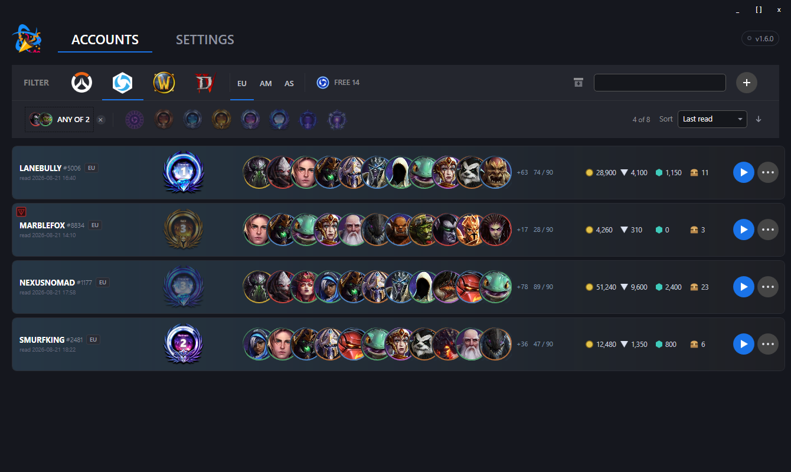

* **Leaver penalty counter** per account, one click up, right click down — and read out of the
  game along with everything else.

Everything is read by looking at the game window and recognising text on it. No memory reading,
no injection, no API keys, nothing that touches Blizzard's servers beyond a normal login.

## What the reading needs

Two things about your game client decide whether the app can read it: **the language of its text**
and **the size of its window**. Both are listed here in full, because a wrong answer to either one
is quiet — nothing crashes, nothing is logged, simply nothing gets read.

### Client language

Heroes of the Storm offers five text languages under **Options → Language and Region → Text
Language** (the second list; the first one only changes the voices and does not matter here).
The app compares what it reads against the wording that language puts on screen:

| Text language in the game | Supported |
|---|---|
| `Deutsch` | ✅ **yes** — the default, and the one everything was measured against |
| `English (US)` | ✅ **yes** — checked word by word against a running client |
| `Français` | ✅ **yes** — measured on a running client, including all 16 hero names that differ |
| `Español (ES)` | ✅ **yes** — measured on a running client |
| `Español (AL)` | ✅ **yes** — measured; ten hero names differ from the Spain version |

**Tell the app which of the five you run** — Settings → Client language. Hero names, rank tiers and
screen labels are matched against the wording the client shows, so a mismatch means nothing gets
read at all. Where nothing is recognised, nothing is written: the app leaves yesterday's numbers
alone rather than replacing them with something wrong.

> **Two gaps outside German and English.** The word the game shows while your placement matches are
> still open has not been measured in French or Spanish, and of the rank tiers only the one the
> test account happened to hold was verified — the rest are the usual ladder and could be off. If a
> rank or a pending placement is not picked up on those languages, that is why; everything else
> reads normally.

For the best results, install the Windows language pack that matches your client language. The text
recognition uses whatever Windows has; without the matching pack it falls back to another language,
which still works for Latin script but gets less reliable on accented words.

Changing it is done **in the game**, not here — and it needs a restart, plus a download the first
time you pick a language that was never installed.

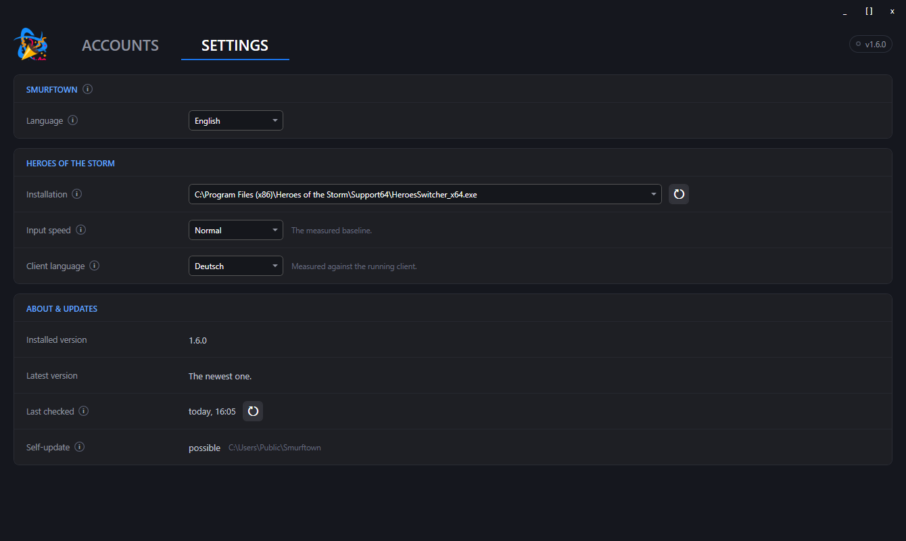

Settings save as you change them; there is no save button anywhere in this app. The same tab is
where the app finds your Heroes of the Storm installation — it looks in the usual places by
itself, and *Scan all drives* is there for when yours is somewhere unusual.

### Screen resolution

The app does not remember coordinates; it remembers **anchors** — an edge or a centre, plus a
distance from it — and scales those distances by the window's **height**. The width only decides
which edge an element clings to, so *any* width at a given height behaves identically.

| Resolution | Reading from the game |
|---|---|
| 3440 × 1440 | ✅ **yes** — the reference everything was measured at |
| 2560 × 1080 | ✅ **yes** — measured |
| 1920 × 1080 | ✅ **yes** — measured |
| any other height | untested — likely fine, but nobody has checked |
| any other width at 1440, 1080 | ✅ same as the row above it, the width does not enter the maths |

Windowed or borderless fullscreen both work; the app measures the client area, not the window
frame. **Remote Desktop does not** — the session takes the resolution of the machine you sit at,
not the one the game runs on, and every measurement comes out wrong.

## Updates

Once an hour, for as long as it is open, Smurftown asks GitHub whether a newer release exists.
The request is anonymous and carries nothing about you, your accounts or what you did with
them — it is the same question anyone can put to a public repository. If there is something
newer, the version chip in the top right corner says so; a click opens this:

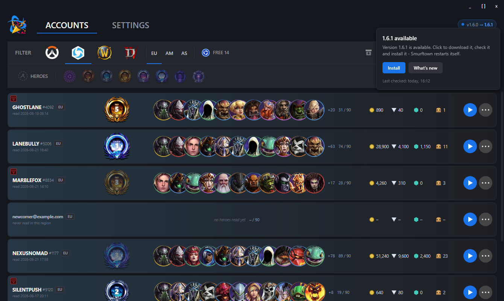

**Install** downloads the release, checks it against the published SHA-256 checksum and puts it
in place; the app restarts itself. Where it may **not** replace its own file — an installation
under `Program Files`, a folder without write permission, a build straight out of the IDE — the
button opens the release page instead and says why. Which of the two applies to your
installation is written in **Settings → About & updates**.

**The checksum proves less than it looks like.** Hash and file come from the same release
over the same connection, so it answers one question — is this the file the release says it
is — and not the other one: who built it. Nothing here is signed, see below.

**There is no switch to turn the check off, and that is deliberate.** A setting nobody finds is
not consent; the honest move is to state the request plainly, which is what this section does.
If you want no outbound traffic at all, block the application in your firewall — the check
fails silently and everything else keeps working.

# Installation

Grab `Smurftown_<version>_win-x64.zip` from
[Releases](https://github.com/tibbots/smurftown/releases), unpack it anywhere and run
`Smurftown.exe`. There is nothing to install: the app keeps everything in
`C:\Users\YOUR_USER\.smurftown` and leaves the rest of your machine alone.

**You need the .NET 8 Desktop Runtime.** Get it from
[dot.net/download](https://dotnet.microsoft.com/download/dotnet/8.0) — *Desktop Runtime*, x64.
Without it Windows says the app cannot start.

**Windows will warn you.** The download is not signed with a certificate Microsoft trusts, so
SmartScreen shows *"Windows protected your PC"*. Choose **More info** → **Run anyway**.

Each release also carries a `checksums.txt`. To check what you downloaded, in PowerShell:

```powershell
Get-FileHash .\Smurftown_1.0.0_win-x64.zip -Algorithm SHA256
```

Requirements:

| | |
|---|---|
| Windows | 10 build 19041 (May 2020) or newer — the app uses the text recognition built into Windows |
| Runtime | .NET 8 Desktop Runtime, x64 — **install it yourself**, see above |
| Rights | plain user — **no administrator rights** |

# Roadmap
* Run several accounts one after another, with pacing between logins and a stop on the first
  failed one
* Handle a two-factor prompt instead of running into the timeout
* Account details for Overwatch, World of Warcraft and Diablo — today those rows only show that
  the game is ticked

# FAQ

### Where can I download the app?
From [Releases](https://github.com/tibbots/smurftown/releases).

### Is this app sending or receiving data from a server on the internet?
Once an hour it asks `api.github.com` whether a newer release exists — anonymously, with nothing
about you or your accounts in the request. Say yes to the offer and it downloads that release
from GitHub as well. That is the whole of the traffic this app produces on its own; see
[Updates](#updates). Everything else happens on this machine, and the only other thing that
leaves it is the game's own login, typed into the game's own login screen.

### So where is my data stored?
In local files only, inside the `.smurftown` folder in your home directory
(`C:\Users\YOUR_USER\.smurftown`). Your account list lives in `data.yaml`.

**Passwords are stored in plain text.** That is what makes copying and typing them possible,
and it is the deliberate trade this app makes — treat the folder like the password store it is.

### Why is one account listed more than once?
Those are its regions. An account gets one row per region it plays in, because rank, heroes and
currencies differ between them — the same battletag can be Platinum in Europe and Bronze in the
Americas. The `EU`, `AM` or `AS` badge next to the battletag says which row is which, and the
region filter in the toolbar shows one region at a time.

### How can I be sure you are not lying?
You can't. Read the source and decide for yourself.

### Why does Windows warn me when I run it?
Because the executable is not signed with a code-signing certificate, and one that Microsoft
trusts costs money this project does not have. The warning is honest: Windows genuinely cannot
tell who built the file. If that bothers you, build it yourself from source — `.\dev.cmd
release` produces the same ZIP the release does.

### Why does it need to see the game window?
Because that is the only place the data exists. Blizzard offers no public interface for hero
ownership, rank or currencies, so the app opens the relevant screens, takes a picture and reads
the text on it — the same way you would, only faster and without the typing.

### Does it need administrator rights?
No, a plain user account is enough. Heroes of the Storm brings its own login screen when you
start it directly, so the app never has to touch anything outside your home directory.
